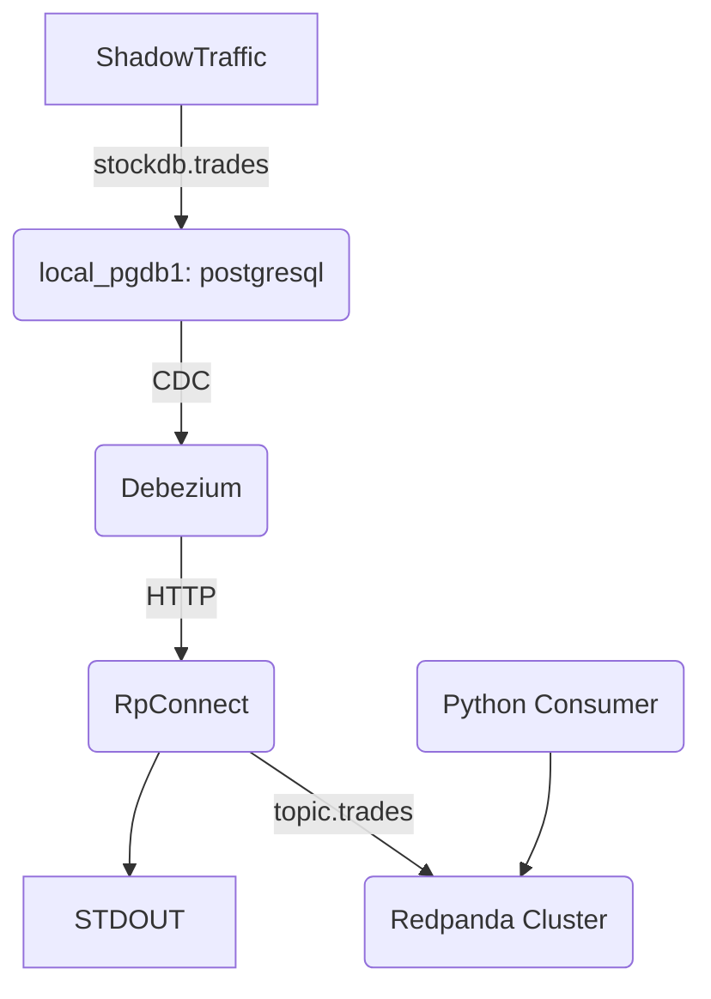

# PostgreSQL commands
```shell
postgres=# \list
postgres=# \c stockdb
psql (14.13 (Homebrew), server 16.4 (Debian 16.4-1.pgdg120+1))
WARNING: psql major version 14, server major version 16.
         Some psql features might not work.
You are now connected to database "stockdb" as user "user-name".
stockdb=# \dt
          List of relations
 Schema |  Name  | Type  |   Owner
--------+--------+-------+-----------
 public | trades | table | user-name
(1 row)

stockdb=# SELECT column_name, data_type, is_nullable,column_default
FROM information_schema.columns
WHERE table_name = 'trades';

 column_name |    data_type     | is_nullable | column_default
-------------+------------------+-------------+----------------
 tradeprice  | double precision | YES         |
 tradevolume | double precision | YES         |
 tradetime   | bigint           | YES         |
 stocksymbol | text             | YES         |

```


<!-- 
```mermaid
erDiagram
          CUSTOMER }|..|{ DELIVERY-ADDRESS : has
          CUSTOMER ||--o{ ORDER : places
          CUSTOMER ||--o{ INVOICE : "liable for"
          DELIVERY-ADDRESS ||--o{ ORDER : receives
          INVOICE ||--|{ ORDER : covers
          ORDER ||--|{ ORDER-ITEM : includes
          PRODUCT-CATEGORY ||--|{ PRODUCT : contains
          PRODUCT ||--o{ ORDER-ITEM : "ordered in"

``` -->
